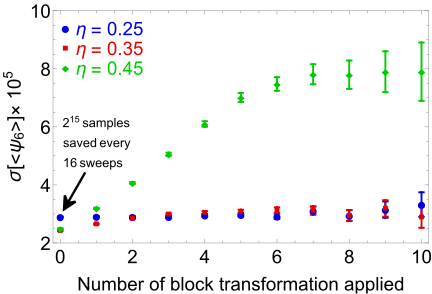
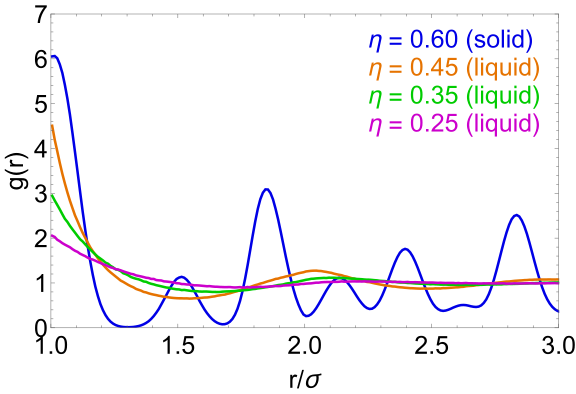
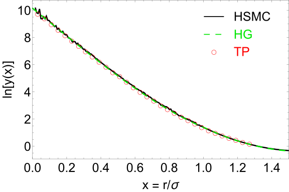
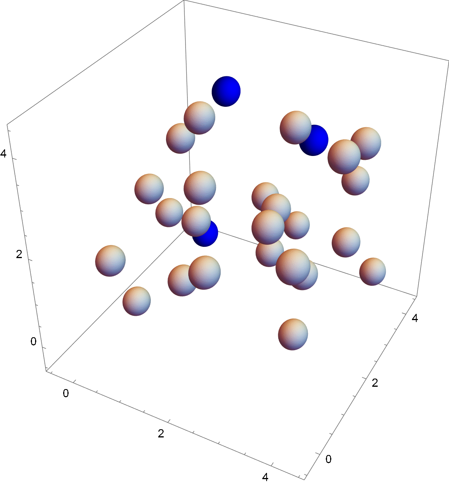

# HSMC

hsmc performs Monte Carlo simulations of mono-disperse hard-sphere systems. The default behavior of the code is to perform simulations in the canonical (NVT) ensemble for which it is possible to monitor
a number of observables including pressure, chemical potential, radial distribution function and order parameter. The code can also perform simulations in the isobaric ensemble (NpT), cavity simulations as described by [Torrie and Patey](https://www.tandfonline.com/doi/abs/10.1080/00268977700102821) and simulations with the cluster moves described by [Krauth](https://arxiv.org/abs/cond-mat/0311623). More information about the observables that can be monitored in the course of such simulations are provided in the section "Input file".

## Compiling

The code can be compiled with the [make file](src/Makefile) provided in the source directory. Please note that in order to correctly compile the program it is necessary 
that the [GNU scientific library](https://www.gnu.org/software/gsl/) and the [zlib library](https://zlib.net/) are installed. 

## Running

In order to run the program it is necessary to create an input file that is passed through the command line via the argument `-i`. More information about the input file 
is given below. A full list of the accepted command line arguments can be retrieved via the command line argument `--help`.

## Input file

In the input file key-words and numerical values are used in order to specify 
the type of simulation that should be performed. Empty lines are skipped, lines starting with # are treated as comments. For the lines that are neither empty nor comments 
it is assumed that 

* Each line contains at most one key-word, if this is not the case then only the first key-word in the line is read
* When one key-word is specified, then all the numerical values associated to that key-word are also specified. i.e. it is not possible to use the default value only for some
  numerical values
* All the input values are given in units in which the length are normalized to the hard-sphere diameter and the energy to k_BT, where k_B is the Boltzmann's constant and 
T is the temperature.

An example of input file for a simple simulation in the canonical ensemble can be retrieved by running hsmc with the command line option `-e`. A more complete overview of the key-words and of the numerical inputs which are expected for each key-word is given below.

* **Cavity simulations**: Cavity simulations as described by [Torrie and Patey](https://www.tandfonline.com/doi/abs/10.1080/00268977700102821) can be performed if the 
                          keyword `cavity` is used. This keyword requires five numerical values: (1) The probability of moving a cavity, (2) the maximum 
                          separation distance between the cavities, (3) the minimum separation distance between the cavities, (3) the saving interval (in number of sweeps)                             and (5) the resolution used to write the cavity interaction potential to file. The samples for the cavity separation are written to the file 
                          *cavity_distance.dat* while the interaction potential between the cavities is written to *cavity_psi.dat*. For the cavity simulations the                                     calculations of pressure, radial distribution function, chemical potential and order parameter are not available.
                          Default: `cavity 0 1.2 0.0 100 0.01`.

* **Chemical potential**: The chemical potential can be computed via the Widom insertion method if the keyword `widom` is specified. This keyword requires two numerical                                 values: (1) The number
                          of insertions that have to be performed each time the chemical potential is sampled and (2) the sampling interval. The output is written to the 
                          file *chem_pot.dat*. Default: `widom 100 0`.

* **Cluster moves**: Monte Carlo simulations with cluster moves as described by [Krauth](https://arxiv.org/abs/cond-mat/0311623) can be performed if the keyword `cluster` is 
                     used. This keyword requires three numerical values: (1) The activation flag (0 or 1), (2) the number of cluster moves which constitute a sweep and (3)
                     the number of standard (i.e. local, non cluster) moves which have to be performed at the beginning of the simulation in order to perturb the perfect 
                     crystal used in the initialization. For these simulations is it possible to collect samples for all the observables which can be monitored in the course
                     of standard NVT simulations. Default: `cluster 0 1 10000`
                     
* **Configuration**: The keyword `config_write` can be used to write the current configuration to file. `config_write` requires two numerical values: (1) the saving interval                      (in number of sweeps) and (2) the number of configurations to write per file. The configurations are written to files called *config_%.dat.gz* where %                        is a numerical identifier for the file. Default `config_write 0 100`          

* **Density**: The density is specified via the keyword `rho` followed by a numerical value for the density itself. For NpT simulations the density specified with `rho` is only used to generate the starting configuration (see section "Simulation box"). Default: `rho 0.5`.

* **Isobaric calculations**: Isobaric calculations in the NpT ensemble can be performed if the keyword `npt` is specified. If `npt` is not specified then the code runs a
                              a standard isothermal simulation in the NVT ensemble. The keyword `npt` requires two numerical values: (1) the pressure and (2) the maximum 
                              volume deformation. In the case the optimizer is used (see section "Optimizer") the volume deformation specified with `npt` will only be used 
                              as an initial guess to the optimization procedure. The density sampled in the course of NpT simulations is written on screen (see Section "Output on screen"). In the course of
                              NpT simulations it is possible to monitor the pressure (via the thermodynamic route) and the order parameter.
                              Default: `npt 0 0.001`.                 
                   

* **Maximum particle displacement**: The maximum particle displacement in the course of standard Monte Carlo moves is specified with `dr_max`. In the
                                     case the optimizer is used (see section "Optimizer") the value specified with `opt` will only be used as an initial guess 
                                     for the optimization procedure. Default `dr_max 0.05`.
                                    
* **Neighbor list**: For efficient calculations of the particle's interactions, the code uses a neighbor list based on cell lists that scales line O(N), with N being the 
                     number of particles. The cell list is speficied via the keyword `neigh_list` which requires two numerical values: (1) The minimum size of the cells
                     (sizes smaller than 1.0 are not allowed) and (2) The maximum number of particles which can be expected in each cell (a safe choice is typically 5 or 10).
                     Default: `neigh_list 1.0 10`
 
* **Optimizer**: The optimizer is used to optimize the particle and volume displacements in order to obtain a target acceptance ratio (which is typically 50%). The optimizer
                  is set with the keyword `opt` which requires five numerical values: (1) An activation flag which (0 or 1), (2) the number of sweeps (1 sweep = N moves)
                  used for the optimization, (3) the number of samples collected during optimization (<= the number of sweeps), (4) the target acceptance ratio for particle
                  moves and (5) the target acceptance ratio for volume moves (which must be specified also if `npt` is not used). Default: `opt 1 1000 10 0.5 0.5` 
                  
* **Output on screen**: The keyword `out` can be used to specify how often to print on screen the information regarding the current sweep. `out` requires one numerical value
                        which specifies how often to print on screen. Default: `out 0`.

* **Order parameter**: The order parameter (as defined by [Lechner and Dellago](https://aip.scitation.org/doi/full/10.1063/1.2977970?casa_token=Pq7x6pG7HZAAAAAA%3ASDGRrjz3OL1_tOC1qLBvvrGSDBdJEBMMDUxZcJSoyTAOEBNouzPmfF23Z25dh7R4D91fsr_0dEJw)) can be computed with the keyword `ql` which requires three 
                        numerical values: (1) The order of the order parameter, (2) The cutoff distance for the neighbor interaction (typically 1.5 is a good choice) and (3)
                        the saving interval (in number of sweeps). This keyword computes an average order parameter for the whole system by averaging over the order parameters
                        of all the particles. The output is written to the file *oder_param.dat*. Default: `ql 6 1.5 0`.

* **Pressure (thermodynamic)**: The pressure calculated via the thermodynamic definition (i.e. via virtual volume compressions) can be computed with the keyword                                                `press_thermo`, which requires three numerical values: (1) The resolution for volume perturbations, (2) the maximimum virtual compression
                                  and (3) the sampling interval (in number of sweeps). The output is written to the files *press_thermo.dat* and *density.dat* (the latter
                                  produced only for isobaric calcualtions). Default: `press_thermo 0.0001 0.002 0`.

* **Pressure (virial)**: The pressure calculated via the virial equation of state (i.e via extrapolating the radial distribution function (RDF) to contact) can be computed                            with the keyword `press_virial`, which requires two numerical values: (1) the resolution for the RDF calculation and (2) the sampling interval (in                             number of sweeps). This calcuation is available only for NVT simulations. The output is written to the file *press_virial.dat*. 
                          Default: `press_virial 0.01 0`.

* **Radial distribution function**: The radial distribution function (RDF) can be computed with the keyword `rdf` which requires four numerical values: (1) The resolution
                                    used in the RDF calculation, (2) the cutoff for the RDF calculation (should not be larger than half the smallest simulation box size), 
                                    (3) the saving interval (in number of sweeps) and (4) the number of samples per output file. All the RDF samples are written to a series                                       of files called *rdf_%.dat.gz* (the total number of files depends on the number of samples that are collected and on numerical parameter 4 ). Each sample contains the information extracted from one configuration, so it is advisable to average the RDF samples before 
                                    using them for any sort of calculation. This calcuation is available only for NVT simulations. 
                                    WARNING: The calculation of the RDF can have a significant impact on performance since it scales like O(N^2). Default: `rdf 0.01 0 10 100`

* **Random number generator**: The random number generator used by hsmc is the [Marsenne Twister implemented in the GNU Scientific Library](https://www.gnu.org/software/gsl/doc/html/rng.html). The seed used to initialize the random number generator can be specified with the keyword `seed`. Default: `seed 0`. 

* **Restart files**: The keywords `restart_write` and `restart_read` can be used to specify how to write and read restart files. `restart_write` requires one  numerical value                      which is  the interval (in number of sweeps) after which a restart file is written. The restart files are in binary format and have the name                                  *restart_%.bin*, where % is the sweep at which the file is written.  `restart_read` can be used to read a restart file and start a simulation from where                      another previous simulations had left off. The optimizer might modify the maximum displacements read from the restart file and, hence, it                      might not allow a perfect restart. `restart_read` requires two numerical values: (1) The activation flag (0 or 1) and (2) the name of the file used to                        read the restart from (note: it should be a file previously produced with `restart_write`). Default:  `restart_write 0` (no restart file is written),                          `restart_read 0 restart_000000.bin` (no restart is performed)

* **Simulation box**: The simulation box is assumed to be a rectangular parallelepiped whose sides are specified by assigning a certain amount of building blocks in each 
                      direction. The building blocks can be either simple cubic (SC) cells or face-centerd cubic (FCC) cells containing, respectively, 1 or 4 particles. 
                      The type of building block specifies also the starting configuration, i.e SC blocks will prodoce a starting configuration in which the particles are 
                      arranged on a cubic lattice while FCC blocks will produce a starting configuration in which the particles are arranged on a FCC lattice.
                      The number of building blocks in the x, y and z directions are specified with the key-words `cells_x`, `cells_y` and `cell_z`, while the type for 
                      the building blocks is specified as `type` followed by 1 for SC blocks or by 2 for FCC blocks. Default:  `cells_x 3`,  `cells_x 3`,  `cells_x 3`,
                       `type 1`
                          

* **Sweeps**: The number of sweeps to perform can be specified with the command `sweep_eq` and `sweep_stat`. Both these commands require one numerical value which specifies                 the number of sweeps to perform. `sweep_eq` is used to specify the number of sweeps for equilibration during which no quantity is sampled (except for the                     density in the course of isobaric simulations) and `sweep_stat` is used to specify the number of steps used to collect the statistics for the desired quantities               Default: `sweep_eq 1000`, `sweep_stat 1000`
             
## Post-processing

The folder [python](https://github.com/fedluc/HSMC/tree/main/python) contains some python modules that can be utilized to analyze the output produced by hsmc.

* hsmc_cavity: analyze output for the cavity simulations
* hsmc_chem_pot: analyze output for the chemical potential obtained via the Widom insertion method
* hsmc_density: analyze output for the density during the isobaric simulations
* hsmc_op: analyze output for the order parameter
* hsmc_pressure: analyze output for the pressure calculations
* hsmc_rdf: analyze the radial distribution function (rdf) output produced by hsmc. This includes the possibility to compute the average rdf, to perform the blocking analysis of the rdf samples (see hsmc_stat for more information on this) and to compute other correlation functions which depend on the rdf (static structure factor, direct correlation function and bridge function)
* hsmc_stat: this module contains a collection of tools for the statistical analysis of the hsmc results. These tools include the [blocking method discussed by Flyvberg](https://doi.org/10.1063/1.457480), the calculation of autocorrelation functions and the jackknife estimate for the standard deviation.

## Examples

### Pressure calculation in the canonical (NVT) ensemble

The table illustrates the results obtained by performing an NVT simulation with 256 particles, 524288 sweeps for equilibration and 524288 for statistics. In the course of the simulation the pressure was computed both with the virial (vir) and with the thermodynamic (thermo) approach. For each value of the packing fraction, the pressure obtained with HSMC is compared to what has been obtained by [DeMiguel and Jackson](https://www.tandfonline.com/doi/full/10.1080/00268970601095335) (MJ) and to the prediction of the [Carnahan-Starling](https://aip.scitation.org/doi/abs/10.1063/1.1672048) (CS) equation of state. The numbers in parenthesis denote the standard deviation calculated via the jackknife method.

| Packing fraction | Press. (CS) | Press. (HSMC, vir) | Press. (MJ, vir) | Press. (HSMC, thermo) | Press. (MJ, thermo)
|  :---:  | :---:  | :---:  | :---:  | :---:  | :---:  |
0.25	|	1.468	|	1.47(37)	|	1.4688(9)	|	1.4(20)	|	1.472(15)
0.30	|	2.278	|	2.28(47)	|	2.2784(13)	|	2.2(30)	|	2.285(19)
0.35	|	3.480	|	3.47(77)	|	3.4841(19)	|	3.4(76)	|	3.495(24)
0.40	|	5.291	|	5.27(95)	|	5.288(3)	|	5.3(97)	|	5.303(29)
0.45	|	8.066	|	8.0(14)	|	8.030(4)	|	8.(19)	|	8.118(35)

### Data analysis via the blocking method

The figure illustrates how the blocking method proposed by Flyvberg can be employed to estimate the standard deviation of the samples collected during a simulation. The standard deviation of the average order parameter calculated at three values of the packing fraction (0.25, 0.35, 0.45) is plotted as a function of the number of blocking transformation applied to the system, at each blocking transformation the size of the data-set is halved by averaging the samples in groups of two. When the curve flattens it signifies that the samples have become un-correlated and that the standard deviation can be safely computed via the usual estimators for uncorrelated data. As expected, the correlation "time" increases if the packing fraction increases. Indeed, at packing fraction 0.25 the samples are uncorrelated without using any blocking transformation, while at packing fraction 0.45 it takes 7 blocking transformations to obtain uncorrelated samples. In other words, at packing fraction 0.25 it is possible to collect uncorrelated samples by saving every 16 sweeps, while at packing fraction 0.45 it is necessary to collect one sample every 2048 sweeps in order to have uncorrelated samples.

### Radial distribution function

The figure presents some examples for the radial distribution function obtained at three state points belonging to the liquid phase and at one point in the solid phase. The horizontal axis represents the inter-particle distance in units of the particle's diameter (sigma).

### Simulations in the isobaric (NpT) ensemble

The table illustrates the results obtained by performing an NpT simulation with 256 particles, 524288 sweeps for equilibration and 524288 for statistics. In the course of the simulations the pressure was also computed with the thermodynamic (thermo) approach in order to check for self-consistency. For each value of the pressure, the packing fraction obtained with HSMC is compared to what has been obtained by [Brumby et. al](https://www.tandfonline.com/doi/full/10.1080/00268976.2010.530301) (BHMJ). The numbers in parenthesis denote the standard deviation calculated via the jackknife method for the pressure and via the flyvberg analysis for the packing fraction.

| Pressure (input) | Pressure (thermo) | Packing fraction (HSMC) | Packing fraction (BHMJ) 
|  :---:  | :---:  | :---:  | :---:  |
1.472	|	1.5(21)	|	0.251(8)	|	0.249(3)
2.280	|	2.3(38)	|	0.30(12)	|	0.300(2)
3.471	|	3.5(60)	|	0.35(10)	|	0.349(2)
5.274	|	5.3(97)	|	0.40(12)	|	0.399(2)

### Cavity simulations

The figure presents the logarithm of the cavity function, lny(x), and compares the result of the cavity simulations performed with HSMC (black solid line) to the analytical parameterization proposed by [Henderson and Grundke](https://aip.scitation.org/doi/abs/10.1063/1.431378) (green dashed line) and to the computer simulation results of [Torrie and Patey](https://www.tandfonline.com/doi/abs/10.1080/00268977700102821) (red circles). All the results refer to density 0.8. The HSMC results were obtained with 1000 particles and 4194304 samples. The horizontal axis in the figure represents the inter-particle distance in units of the particle's diameter (sigma).

### Chemical potential in the NVT ensemble

The table illustrates the results obtained by performing an NVT simulation with 256 particles, 524288 sweeps for equilibration and 16777216 for statistics. In the course of the simulation the chemical potential was computed via the Widom insertion method. For each value of the density, the chemical potential obtained with HSMC is compared to what has been obtained by [Adams](https://www.tandfonline.com/doi/abs/10.1080/00268977400102551). The last column reports the percentual of attempted insertions that were accepted, the very small acceptance ratio at the highest density signals that the widom method becomes inaquate for the calculation of the chemical potential.

| Density | Adams | HSMC | Accepted insertions (%) |
|  :---:  | :---:  | :---:  | :---:  |
0.1	|	0.466	|	0.464	|	62
0.3	|	1.77	|	1.754	|	17
0.5	|	3.832	|	3.856	|	2.2
0.7	|	7.391	|	6.656	|	0.1

### Cluster moves

The animation shows a series of cluster moves for a simulation with 27 particles at density 0.4. The colored particles correspond to the particles that belong to the cluster and that are rotated around a randomly chosen pivot inside the simulation box. 

The pressures reporeted in the table demonstrate that, despite adopting an entirely different strategy for the particle motion, the cluster moves produce results which are consistent with the standard Monte Carlo moves. All the results reported in the table were obtained with 256 particles, the number in parenthesis denote the standard deviation obtained with the jackknife method.

| Packing fraction  | Press. (standard MC) | Press. (cluster MC)
|  :---:  | :---:  | :---:  |
0.25	|	1.47(37)	|	1.46(38)	|	
0.30	|	2.28(47)	|	2.27(41) 	|	
